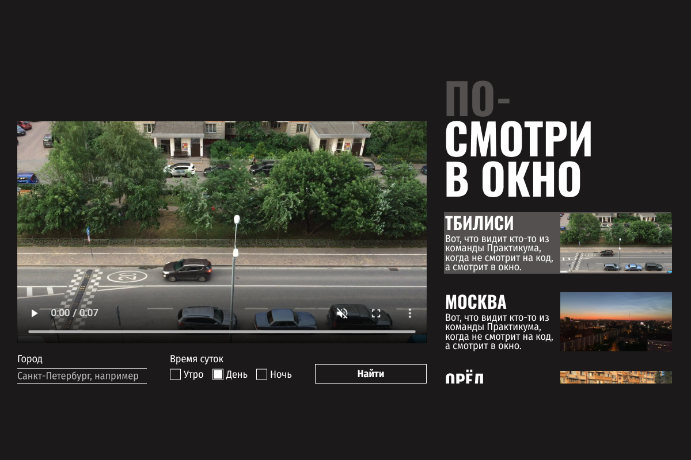

https://github.com/nkosholkin/posmotri_v_okno.git

## Второй проект по обучению в Яндекс Практикуме "Посмотри в окно".

### Основные задачи:
1. На основе уже готовой разметки использовать навыки CSS для создания целевой веб-страницы
2. Целевой результат:
